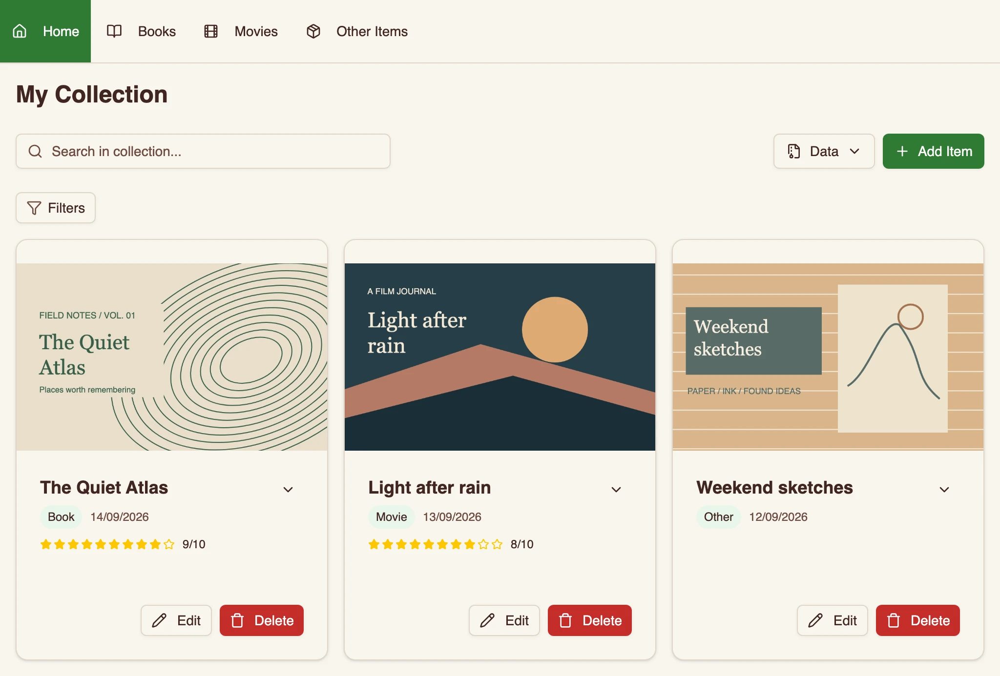
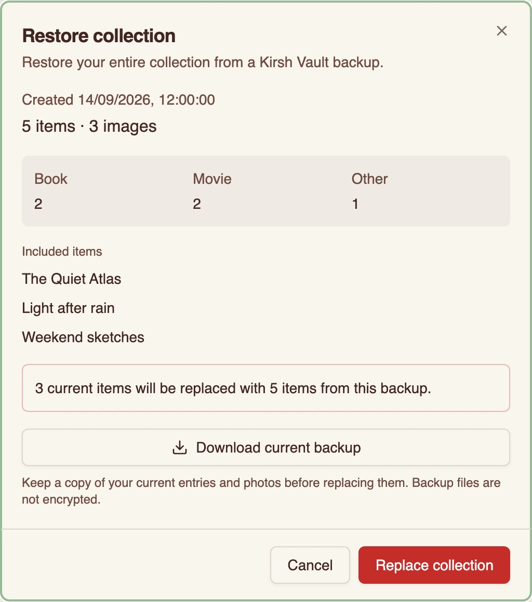

# Kirsh Vault

Keep your books, movies and personal finds in one collection. Add notes and photos, revisit them offline, and move everything to another browser with a ZIP backup.

**[Open Kirsh Vault](https://kirshway.github.io/kirsh_vault/)** · [Run locally](#run-locally) · [Development guide](docs/development.md)

<picture>
  <source media="(max-width: 600px)" srcset="assets/readme/collection-mobile.webp">
  
</picture>

_The application running locally with illustrative sample entries._

## Collection tools

- **Organize:** books, movies and other items, with descriptions, up to five photos, and ratings for books and movies.
- **Find:** search names and descriptions across the collection, combine category and rating filters, and browse paginated results.
- **Inspect:** a gallery that fits the viewport, with zoom, panning, thumbnails and keyboard controls.
- **Keep using it offline:** once the application has cached its assets, collections and backups work without a connection.
- **Take it with you:** export entries and their images together, then preview a backup before restoring it elsewhere.

Built with **Next.js, React, TypeScript and Dexie**. Collection data lives in IndexedDB in your browser; the application has no account system, backend API, analytics or cloud synchronization.

## Backup and restore

The **Data** menu always acts on the whole collection, including entries hidden by filters.

1. Choose **Download backup**, wait for preparation, then **Save backup**. The ZIP contains entries and their stored image bytes. Preparation can be cancelled; the app cannot confirm that you finished saving the file.
2. In the destination browser, choose **Restore from file**. The app validates the archive locally and shows its date, category counts, images and example entries before changing anything.
3. If needed, choose **Download current backup**, then **Save current backup**, without losing the prepared import.
4. Choose **Replace collection** to replace all current entries in one transaction. Search, filters and pagination reset after success.

**Restoration replaces the collection; it does not merge it.** An empty backup deletes all current entries. There is no built-in undo. Backup files are **unencrypted**, so keep a copy somewhere appropriate outside the browser.

<details>
<summary>See the restore preview</summary>



</details>

## Engineering decisions

**Validate first, replace atomically.** ZIP work runs in a dedicated Web Worker. Verified entries are staged separately; only confirmation opens the replacement transaction. A write failure rolls back the replacement. A committed operation receipt lets the UI recognize success even if the worker's final message is lost. [Format and guarantees →](docs/backup-format.md)

**Treat other tabs as concurrent writers.** Web Locks serialize backup sessions. Revisions detect edits after preview, and a collection generation prevents an old form from overwriting restored data. Conflicting drafts stay visible. [Database operations →](lib/db.ts)

**Read only the data a view needs.** Category pages use an index. Search scans lightweight records without images, ranks results before pagination, then loads the visible entries. Search remains linear and is intended for personal collections. [Collection queries →](lib/hooks/useCollectionItems.ts)

**Keep offline releases consistent.** The service worker caches the static build, including lazy-loaded gallery and backup modules. An update activates after tabs using the old release close, so assets are not replaced underneath an open form. [Offline lifecycle →](docs/development.md#offline-releases-and-deployment)

The [development guide](docs/development.md#code-map) maps these responsibilities to their source files.

## Run locally

Use **Node.js 24.21.0** and **Bun 1.4.2**, matching CI.

```sh
git clone https://github.com/KirshWay/kirsh_vault.git
cd kirsh_vault
bun install --frozen-lockfile
bun run dev
```

Open the address printed in the terminal. No environment variables, credentials or database server are required. The service worker is disabled in development.

## Verification and deployment

```sh
bun run lint
bun run typecheck
bun run test
bun audit
bun run build
```

For browser tests, install the test browsers once and run against that production build:

```sh
bunx playwright install --with-deps chromium firefox webkit
bun run test:e2e
```

Tests cover migration, byte-for-byte backup round trips, malformed archives, transaction rollback, cancellation, concurrent tabs, stale forms, gallery navigation and offline startup. Playwright runs headlessly in Chromium, Firefox and WebKit. Touch-gesture injection is additionally checked in Chromium emulation; it is not a physical-device test.

[GitHub Actions](.github/workflows/deploy.yml) runs the checks on pull requests and pushes to `main`. Only a successful push build on `main` publishes the tested `out/` artifact to `gh-pages`. [React Doctor](.github/workflows/react-doctor.yml) runs separately in advisory mode. See the [development guide](docs/development.md) for coverage, analysis settings and the optional large-backup benchmark.

## Limits and privacy

- **Local storage:** data belongs to the current browser profile and origin. Clearing site data or browser eviction can remove it. Offline caching is not a backup, and stored entries are not encrypted.
- **Backups:** up to 250 MiB each for the ZIP and its unpacked contents, 10,000 entries and five images per entry. Images support JPEG, PNG and WebP, up to 10 MiB and 40 megapixels each. Preparation needs additional browser storage; quota errors abort without a partial replacement.
- **Photos:** ordinary uploads are resized to at most 1600 pixels on the longest edge. Zoom displays the stored detail. Backup restores preserve image bytes without another resize or re-encode; external image URLs are never fetched.
- **Browsers:** the app relies on IndexedDB, Web Workers, Web Locks and service workers. Offline use requires an initial successful online cache installation. Standalone PWA installation depends on the browser.

[Backup specification and measured performance](docs/backup-format.md) · [Development and verification](docs/development.md)
